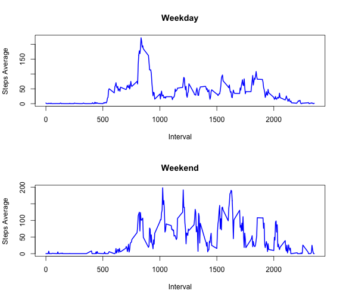

# Reproducible Research: Peer Assessment 1
<!-- 
Load required R libraries
-->
First we'll start by loading all the needed libraries

```r
library(lattice)
library(ggplot2)
library(lubridate)
library(xtable)
library(plyr)
```

```
## 
## Attaching package: 'plyr'
## 
## The following object is masked from 'package:lubridate':
## 
##     here
```


<!--
modify
-->

## Loading and preprocessing the data
We will start by loading and doing some processing of the dataset we have


```r
data <- read.table(unz("./activity.zip", "activity.csv"), header = TRUE, sep = ",", 
    na.strings = "NA")
```


Take a quick look at the data with the `str` command in R: 


```r
str(data)
```

```
## 'data.frame':	17568 obs. of  3 variables:
##  $ steps   : int  NA NA NA NA NA NA NA NA NA NA ...
##  $ date    : Factor w/ 61 levels "2012-10-01","2012-10-02",..: 1 1 1 1 1 1 1 1 1 1 ...
##  $ interval: int  0 5 10 15 20 25 30 35 40 45 ...
```


Next we will convert the `date` column in the dataset to date values with the `lubridate` package


```r
data$date <- ymd(data$date)
```


And our new data frame looks like: 


```r
str(data)
```

```
## 'data.frame':	17568 obs. of  3 variables:
##  $ steps   : int  NA NA NA NA NA NA NA NA NA NA ...
##  $ date    : POSIXct, format: "2012-10-01" "2012-10-01" ...
##  $ interval: int  0 5 10 15 20 25 30 35 40 45 ...
```


## What is mean total number of steps taken per day?

First let's make a histogram of the total number of steps taken per day.   
Get total number of steps for each day and then histogram the results:


```r
stepsTotDay <- with(data, aggregate(steps, list(date), sum))
hist(stepsTotDay$x, main = "Distribution of Total Steps Taken Per Day", xlab = "Total Number of Steps per day", 
    col = "steelblue")
```


Next we will calculate and Mean and Median of the total steps taken each day:


```r
## Get the mean and median values for each day
Mean <- mean(stepsTotDay$x, na.rm = TRUE)
Median <- median(stepsTotDay$x, na.rm = TRUE)
```


The mean of the total number of steps taken per day is **10766** while the median is **10765**

## What is the average daily activity pattern?


```r
Interval <- data[as.character(data$date) == "2012-10-01", ]$interval
Interval_Avg <- with(data, aggregate(steps, list(interval), mean, na.rm = TRUE))
plot(Interval, Interval_Avg$x, "l", col = "blue", main = "Average Steps per 5 Minute Interval", 
    xlab = "Interval", ylab = "Steps Average", lwd = 2)
```


```r
Max <- max(Interval_Avg$x)
Max_Interval <- Interval[which.max(Interval_Avg$x)]
cat(sprintf("Maximum average is %.2f which occurs on the %.0f 5-minute interval", 
    Max, Max_Interval))
```

```
## Maximum average is 206.17 which occurs on the 835 5-minute interval
```


The 5-minute interval that, on average, contains the maximum number of steps is the **835** interval with the maximum average of **206.1698** steps.

## Imputing missing values
To get the total number of missing values we use the `count` function from the `plyr` package as follows:


```r
totalNAs <- count(data[is.na(data$steps), ]$steps)[2]
```


There are a total of **2304** rows with `NA` entries. 

The strategy we will use to fill in the missing values is to use the mean of that 5-minute interval, i.e. the values presented in the timeline plot above. 


```r
## Get intervals for NAs in the data
NAIntervals <- data[is.na(data$steps), ]$interval
## Subet dataframe on the NAs
Fill <- Interval_Avg[Interval_Avg$Group.1 %in% NAIntervals, ]
## copy the old data set to a new one which will be modified to contain no
## NAs but first let's rearrange the columns
data <- data[c("date", "steps", "interval")]
dataNew <- data
for (i in 1:nrow(dataNew)) {
    if (is.na(dataNew$steps[i])) {
        dataNew$steps[i] <- Fill$x[i]
    }
}
```


The **new data** set has no `NAs` in it as can be seen below:

```r
head(dataNew, 20)
```

```
##          date   steps interval
## 1  2012-10-01 1.71698        0
## 2  2012-10-01 0.33962        5
## 3  2012-10-01 0.13208       10
## 4  2012-10-01 0.15094       15
## 5  2012-10-01 0.07547       20
## 6  2012-10-01 2.09434       25
## 7  2012-10-01 0.52830       30
## 8  2012-10-01 0.86792       35
## 9  2012-10-01 0.00000       40
## 10 2012-10-01 1.47170       45
## 11 2012-10-01 0.30189       50
## 12 2012-10-01 0.13208       55
## 13 2012-10-01 0.32075      100
## 14 2012-10-01 0.67925      105
## 15 2012-10-01 0.15094      110
## 16 2012-10-01 0.33962      115
## 17 2012-10-01 0.00000      120
## 18 2012-10-01 1.11321      125
## 19 2012-10-01 1.83019      130
## 20 2012-10-01 0.16981      135
```


compared to the **old data** set which still has `NAs` in it:

```r
head(data, 20)
```

```
##          date steps interval
## 1  2012-10-01    NA        0
## 2  2012-10-01    NA        5
## 3  2012-10-01    NA       10
## 4  2012-10-01    NA       15
## 5  2012-10-01    NA       20
## 6  2012-10-01    NA       25
## 7  2012-10-01    NA       30
## 8  2012-10-01    NA       35
## 9  2012-10-01    NA       40
## 10 2012-10-01    NA       45
## 11 2012-10-01    NA       50
## 12 2012-10-01    NA       55
## 13 2012-10-01    NA      100
## 14 2012-10-01    NA      105
## 15 2012-10-01    NA      110
## 16 2012-10-01    NA      115
## 17 2012-10-01    NA      120
## 18 2012-10-01    NA      125
## 19 2012-10-01    NA      130
## 20 2012-10-01    NA      135
```


```r
stepsTotDayNew <- with(dataNew, aggregate(steps, list(date), sum))
hist(stepsTotDayNew$x, main = "Distribution of Total Steps Taken Per Day", xlab = "Total Number of Steps per day", 
    col = "red")
```


```r
## Get the mean and median values for each day
Mean <- mean(stepsTotDayNew$x, na.rm = TRUE)
Median <- median(stepsTotDayNew$x, na.rm = TRUE)
```


The mean of the total number of steps taken per day is **10766** while the median is **10765**.  
<font color="blue">_**The mean and the median values didn't change when imputing the missing values.**_</font>

## Are there differences in activity patterns between weekdays and weekends?
First we will add new factor variable to the dataframe to distinguish weekdays from weekends


```r
dataNew$weekday <- weekdays(dataNew$date)
## Function to factor weekdays in weekend and weekdays
dayofweek <- function(x) {
    if (weekdays(x) == "Satruday" | weekdays(x) == "Sunday") {
        return("Weekend")
    } else {
        return("Weekday")
    }
}
## add new weekend/weekday factor to the dataframe
dataNew$weekend <- as.factor(sapply(dataNew$date, FUN = dayofweek))
```


Now we split the data and plot the 5-minute averages for each case separately

```r
weekdaydata <- split(dataNew, dataNew$weekend)[[1]]
weekenddata <- split(dataNew, dataNew$weekend)[[2]]
weekday_Avg <- with(weekdaydata, aggregate(steps, list(interval), mean, na.rm = TRUE))
weekend_Avg <- with(weekenddata, aggregate(steps, list(interval), mean, na.rm = TRUE))
par(mfrow = c(2, 1))
plot(Interval, weekday_Avg$x, "l", col = "blue", main = "Weekday", xlab = "Interval", 
    ylab = "Steps Average", lwd = 2)
plot(Interval, weekend_Avg$x, "l", col = "blue", main = "Weekend", xlab = "Interval", 
    ylab = "Steps Average", lwd = 2)
```




From the plot above, it is clear that there is a difference in the activities between the weekend and weekdays
